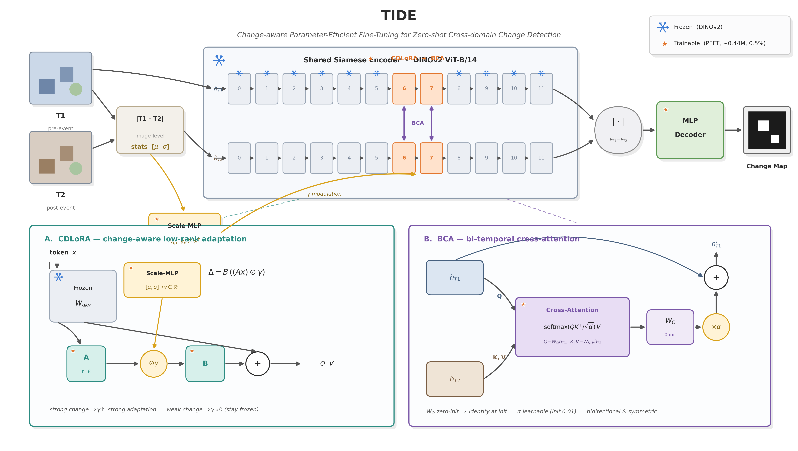
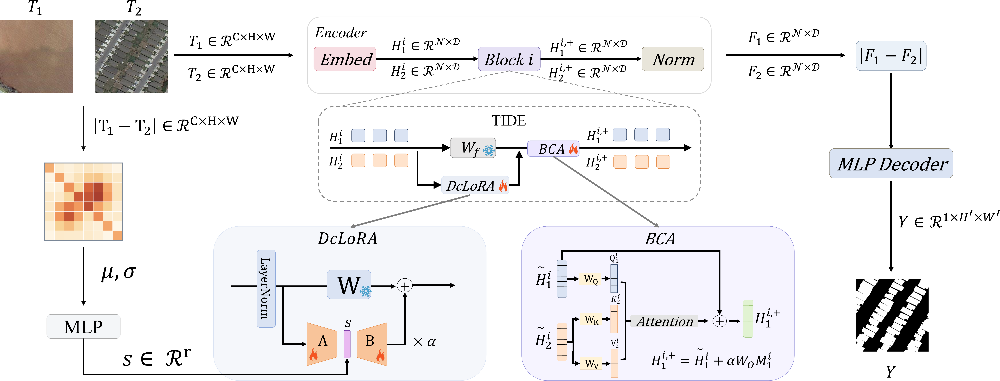

# TIDE: Temporal Interaction for Domain-Generalized Change Detection

TIDE is a parameter-efficient bi-temporal change-detection framework built on
DINOv2. It combines change-aware low-rank adaptation (CDLoRA) with
bi-temporal cross-attention (BCA) for cross-domain remote-sensing change detection.




## Architecture



## Installation

Python 3.10+ and a CUDA-capable PyTorch installation are recommended.

```bash
git clone https://github.com/zhekaizhang-ai/TIDE.git
cd TIDE
pip install -r requirements.txt
```

The first run downloads the DINOv2 ViT-B/14 backbone through `torch.hub`.

## Data preparation

Data are not distributed in this repository. Obtain each dataset under its
own license and arrange it as follows (the legacy single-source path is also
supported via `--data_root`):

```text
$TIDE_DATA_ROOT/
├── LEVIR-CD/
│   ├── A/  B/  label/
│   └── list/{train,val,test}.txt
├── CD_Data_GZ/
├── WHU-CD/
├── CDD/
├── HRCUS-CD/
└── ...
```

Every dataset directory uses the same `A/`, `B/`, `label/`, and `list/` layout.

```bash
export TIDE_DATA_ROOT=/path/to/change-detection-datasets
```

## Training

```bash
python train.py \
  --mode cdlora_2d_bca \
  --train_sources LEVIR --eval_targets LEVIR \
  --lora_rank 8 \
  --cdlora_start 6 --cdlora_end 8 \
  --bca_start 6 --bca_end 8 \
  --exp_dir experiments/tide_levir
```

For a single dataset outside the standard directory names:

```bash
python train.py --data_root /path/to/LEVIR-CD --exp_dir experiments/tide_levir
```

## Evaluation

```bash
python eval.py --exp_dir experiments/tide_levir --method tide --batch_size 32
```

## Availability

This public release contains source code, documentation, and the method
illustration only. Datasets, trained weights, logs, and full experiment
artifacts are intentionally not released. The DINOv2 backbone is fetched from
its upstream project at runtime; please follow its license and the licenses of
